# DuskPad

**A private token launchpad on Midnight. Prove you qualify, buy unseen, claim unlinked.**

DuskPad runs compliant token sales where the chain enforces every rule (KYC level, blocked regions, per-person caps, soft cap refunds, vesting) without learning who bought, where they live, or how many tickets any one person holds. Buyers pay in a shielded stablecoin, and vested tokens can be claimed from a wallet that never touched the sale.

> Testnet software. The KYC issuer is a **mock** that signs whatever you ask for. The contracts and the optional auditor-disclosure construction have **not** been audited. Do not use with real funds.

<p align="center">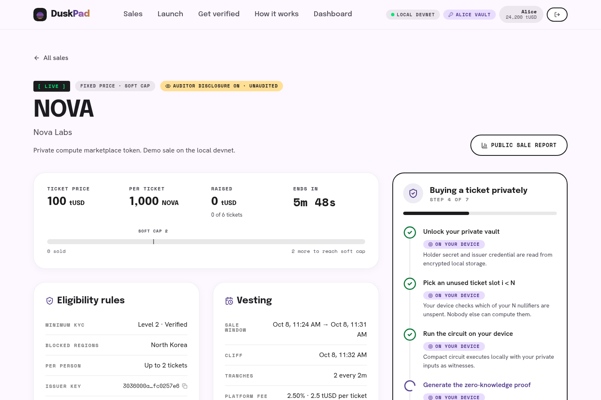</p>

---

## Contents

- [Why Midnight](#why-midnight)
- [Features](#features)
- [Architecture](#architecture)
- [Privacy model: what is public, what is not](#privacy-model)
- [Run it locally](#run-it-locally)
- [Preprod](#preprod)
- [Wallets](#wallets)
- [Tests](#tests)
- [Repository layout](#repository-layout)
- [Findings while building](#findings-while-building)
- [Limits and future work](#limits-and-future-work)
- [License](#license)

## Why Midnight

A launchpad needs two things that public chains force you to trade off: **compliance** (only eligible, KYC'd people from allowed regions, at most N tickets each) and **privacy** (buyers do not want their identity, jurisdiction or position size published forever).

Midnight makes both possible in one contract:

| Need | Midnight primitive | How DuskPad uses it |
|---|---|---|
| Check KYC without publishing it | Zero-knowledge circuits written in Compact | A Jubjub Schnorr signature from the issuer over (holder commitment, country, KYC level, expiry) is verified **inside** the buy proof. The chain learns only that the checks passed. |
| Per-person cap without identities | Nullifiers in contract state | Ticket *i* of a person spends `H(saleId, holderSecret, i)`, with *i < N* proven in-circuit. Two tickets of the same person look unrelated. |
| Pay without revealing the payer | Shielded tokens (Zswap) | Tickets are paid in shielded tUSD. The wallet adds inputs and change; no buyer key appears in the transaction. |
| Refund or claim without linking to the buy | Merkle-tree membership proofs | Each ticket inserts a receipt commitment. Refunds and claims prove membership with a path and spend a receipt nullifier, so they cannot be matched to a purchase. |
| Deliver tokens to any wallet | Contract-minted shielded coins | `claim` mints sale tokens to the caller, which can be a fresh wallet holding only the vault backup. |

On a transparent chain this needs a trusted operator or an off-chain allowlist. With FHE-only designs the per-person cap and unlinkable claims still need extra machinery. Here each one is a few lines of Compact.

## Features

| # | Feature | Status | Where it is enforced |
|---|---|---|---|
| 1 | Eligibility pass from a **mock** KYC issuer: minimum KYC level, up to 4 blocked countries, expiry | Working | Buy circuit |
| 2 | Fixed-price tickets paid in shielded tUSD, one per transaction | Working | Buy circuit and Zswap |
| 3 | Up to N tickets per person | Working | Buy circuit (nullifier per ticket index) |
| 4 | Two sale types: fixed price with soft cap, and capped first-come | Working | Constructor and `finalize` |
| 5 | Soft cap with private refunds | Working | `refund` circuit (Merkle proof + receipt nullifier) |
| 6 | Vesting cliff and up to 48 tranches; claim from any wallet | Working | `claim` circuit (block-time gate per tranche) |
| 7 | Project withdraws net of the platform fee; platform collects fees | Working | `withdraw` / `collectFee` circuits |
| 8 | Create Sale page (one contract per sale) and Explore (off-chain registry) | Working | Browser + API registry |
| 9 | Public sale report from the indexer | Working | Browser (indexer GraphQL) |
| 10 | Private buyer dashboard: local vault, master-secret derivation, encrypted backup and import | Working | Browser (IndexedDB + WebCrypto) |
| 11 | Wallets: 1AM and Lace via the DApp Connector API; local dev wallets; Preprod config | Code path tested with a DApp Connector adapter; real extensions not yet tested (see [Wallets](#wallets)) | Browser |
| 12 | Optional auditor disclosure behind a per-sale flag, **unaudited** | Working | Buy circuit (hashed ElGamal to an auditor key) |

## Architecture

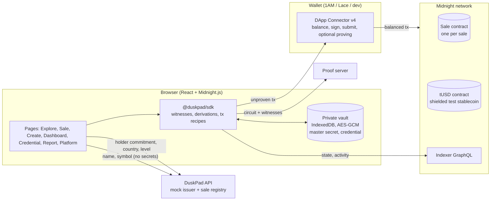

What runs where:

- **Contracts** (`contracts/src`): `sale.compact` holds config, vault, receipts and nullifiers for one sale. `tusd.compact` is a faucet stablecoin whose token color is derived off-chain from its address.
- **SDK** (`packages/sdk`): shared by the browser and the Node e2e suite. Covers credentials, secret derivation, witnesses, transaction recipes with real pipeline stage events, the indexer report, encrypted backups and the privacy table.
- **Frontend** (`frontend`): React 19, Vite, Tailwind. The design language follows the earlier dutch-auction project and the code is new. Proving goes to a proof server, or to the wallet when it offers proving (1AM).
- **API** (`services/api`): a tiny Node HTTP service. It hosts the **mock** issuer (signs holder commitment, country and level, and never sees wallet addresses) and the off-chain sale registry (names and descriptions; numbers always come from the chain).
- **Dev wallet bridge** (`services/dev-wallet`, local only): headless wallets exposed through the same DApp Connector interface, so the app has one code path for 1AM, Lace and dev accounts.

Secrets: one 32-byte **master secret** per vault. Everything else is derived from it:
`holderSecret = H("dusk:holder", m)`, `receiptSecret_i = H("dusk:receipt", m, saleId, i)`, `adminSecret = H("dusk:admin", m, saleId)`. Tickets are therefore recoverable from chain state with only the master secret, which is what makes "claim from a fresh wallet" a matter of importing an encrypted backup.

## Privacy model

Measured on a local ledger-8 network by decoding real transactions, reading the indexer and the contract state (see the research notes, section 7). The app shows the same table on **How it works** and in the per-transaction stepper.

| Action | Public | Hidden |
|---|---|---|
| **Buy** | Sale address, entry point; the payment coin written to the vault (color, value = price, nonce); a buy nullifier and a receipt commitment; tickets sold +1 | Buyer wallet and identity; country, KYC level, expiry, holder secret; how many tickets a person holds; buyer's other coins and change |
| **Refund** | Entry point; the vault coin spent; a refund nullifier; one output with no owner | Who was refunded; which purchase it was |
| **Claim** | Entry point and tranche; a public mint of the sale token (amount); a claim nullifier; one output with no owner | Who claimed; any link to the buy or the buying wallet |
| **Withdraw** | Entry point; vault coin spent; fee coin moved to the fee vault (so the net amount is derivable) | Project's receiving address; the admin secret |
| **Collect fee** | Entry point; fee coin spent | Platform's receiving address |
| **Create / finalize** | Every sale parameter; the phase change | Project admin secret (only its hash is stored) |

**Honest limits:**

- Ticket price, tickets sold, total raised, the project's net and the platform fee are public. Amounts are private per *person*, not per sale.
- Each claim reveals its tranche and amount.
- Transaction fees are paid in DUST by the submitting wallet, and DUST generation is tied to that wallet's NIGHT. Claim from a wallet you don't mind being seen paying a fee.
- "N per person" is only as strong as the issuer's one-credential-per-person policy.
- Timing analysis is possible. A buy right after someone visits a sale page is visible as "a buy", though not whose.
- With the auditor flag on, the auditor can decrypt which credential holder bought each ticket (that is the point of the flag). The issuer can map credential holders to people.
- The issuer sees the holder commitment, country and level when issuing (not the wallet address). A real issuer would also see the identity documents.

## Run it locally

Prerequisites: Node 22+, Docker, and the Compact toolchain pinned to **0.31.1**.

```bash
# 1. Compact compiler (once)
curl --proto '=https' --tlsv1.2 -LsSf https://github.com/midnightntwrk/compact/releases/latest/download/compact-installer.sh | sh
compact update 0.31.1

# 2. Install and compile the contracts (about a minute)
npm ci
npm run compile

# 3. Local Midnight stack: node 1.0.400 (ledger 8), indexer 4.3.5, proof server 8.1.0
npm run stack:up            # docker compose -f docker/stack.yml up -d  (host networking)

# 4. Services (three terminals)
npm run dev:wallet          # funds dev accounts, registers DUST, deploys tUSD, writes services/api/data/networks.json
npm run dev:api             # mock issuer + registry on :8787
npm run dev:web             # http://127.0.0.1:5173
```

Open the app, click **Connect wallet**, and pick a dev account (Alice, Bob, Carol, Nova Labs, DuskPad Ops, Fresh wallet). A typical tour:

1. **Nova Labs** → Launch: deploy a sale (fixed price, soft cap, KYC level, blocked regions, vesting).
2. **Alice** → Get verified: request a mock credential. Then Dashboard: mint test tUSD. Then the sale: buy a ticket and watch the private pipeline.
3. After the window: anyone **finalizes**. If the soft cap was missed, buyers **refund** privately. If it succeeded, Nova Labs **withdraws** net of the fee and DuskPad Ops **collects** the fee on Platform.
4. **Alice** → Dashboard: export an encrypted backup. **Fresh wallet** → Dashboard: import it, then claim the vested tokens from that wallet.

The dev wallet bridge binds to 127.0.0.1 only and signs anything it is asked to. It is a local development tool, never deploy it.

## Preprod

`VITE_NETWORK=preprod npm run build:web` switches the app to the Preprod indexer (`indexer.preprod.midnight.network`, API v4) and takes the proof server URL from the connected wallet. The dev wallets are hidden and 1AM or Lace are required. Before Preprod works end to end, an operator must:

1. Deploy `tusd.compact` on Preprod and add a `preprod` entry to `services/api/data/networks.json` (tUSD address and color, platform fee key, issuer key).
2. Host the API somewhere the browser can reach (`VITE_API_URL`).

Deployments on Preprod use `mode: 'async'` (the app returns once the wallet accepts the transaction; the registry retries until the indexer sees the contract). **None of this has been run on Preprod yet**: everything here was verified on a local ledger-8 network that runs the same ledger version as Preprod.

## Wallets

- **1AM** (primary) and **Lace** are discovered through `window.midnight` (DApp Connector API v4). The app calls `connect(networkId)`, `getConfiguration`, `getShieldedAddresses`, `balanceUnsealedTransaction`, `submitTransaction`, and `getProvingProvider` when available (1AM proves inside the extension).
- **Dev wallets** (local only) implement the same interface over HTTP, using testkit-js `DAppConnectorWalletAdapter` on real headless wallets.
- **Verified:** the DApp Connector code path (deploy, mint, private buy) in the e2e suite (W-1..W-3) and every browser flow with dev wallets.
- **Not yet verified:** the real 1AM and Lace extensions, which need a desktop browser session. See the checklist in [`docs/desktop-testing.md`](docs/desktop-testing.md).

## Tests

| Suite | Command | What it covers | Result |
|---|---|---|---|
| Contract simulator | `npm test -w @duskpad/contracts` | 51 sale + 3 tUSD tests on the compiled contract, in-process (every assertion message, caps, phases, fee and tranche math, auditor records) | **54 / 54** |
| SDK unit | `npm test -w @duskpad/sdk` | Credentials, derivations, backups (wrong passphrase, tampering), schedule math, address parsing | **16 / 16** |
| API | `npm test -w @duskpad/api` | Mock issuer validation and signatures, registry validation | **5 / 5** |
| End-to-end matrix | `npm run e2e` | The 44-row feasibility matrix reproduced on DuskPad's contracts plus 3 extras, real proofs and transactions on the local stack | **47 / 47** (44/44 matrix rows + 3 extras) |
| Browser flow | `npm run e2e:ui` | Playwright drives the production build with dev wallets: 2 sales, credentials, 4 buys, cap and region checks, finalize both ways, refund, withdraw, fee collection, backup export/import, fresh-wallet claim, report, auditor view | **19 / 19** steps |

The latest e2e report is in [`e2e/reports/LATEST.md`](e2e/reports/LATEST.md) (raw: `LATEST.json`); the browser-flow results are in `e2e/reports/UI-LATEST.json`. The browser flow is resumable (`RESUME=1 npm run e2e:ui`) because each persona keeps a persistent browser profile holding its private vault.

Both e2e suites ran on 8 Oct 2026 against the local stack: the matrix in about 21 minutes (it waits for real sale windows and vesting cliffs), and the browser flow in about 10 minutes.

### Screenshots (browser flow, local devnet)

| | |
|---|---|
| 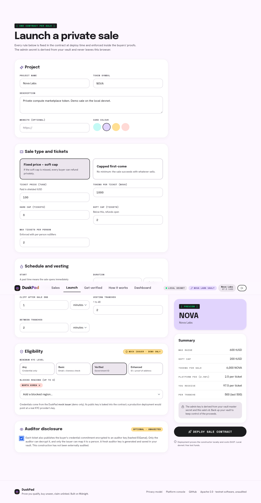 Create a sale | 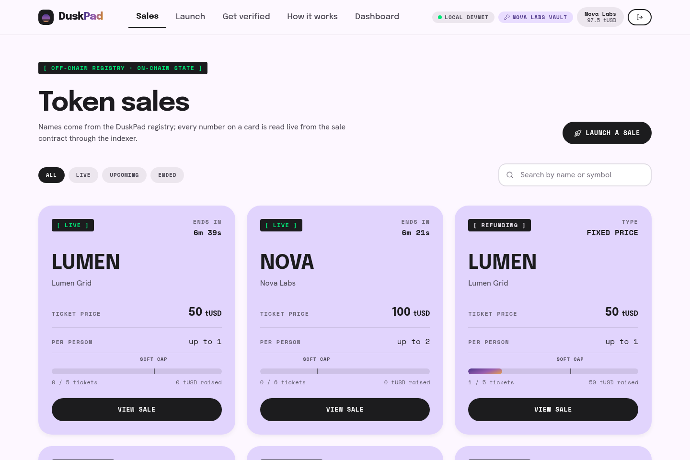 Explore |
| 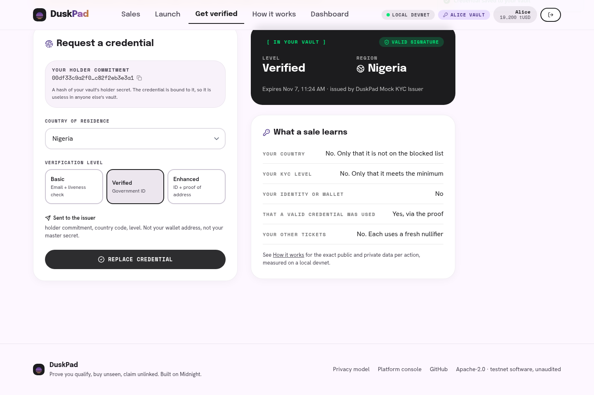 Mock credential |  Buying privately |
| 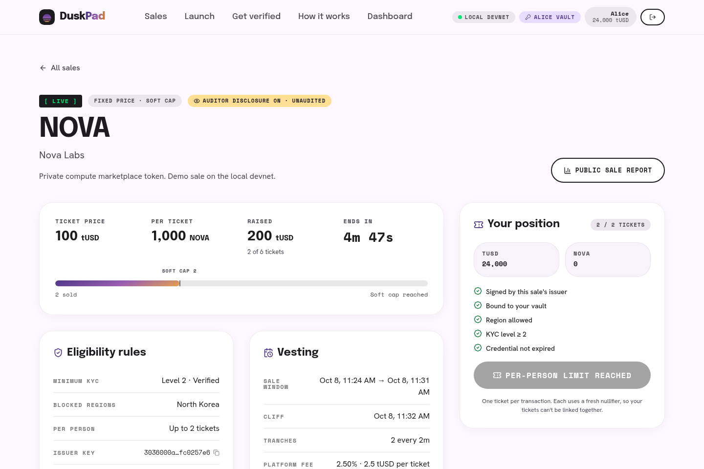 Per-person cap | 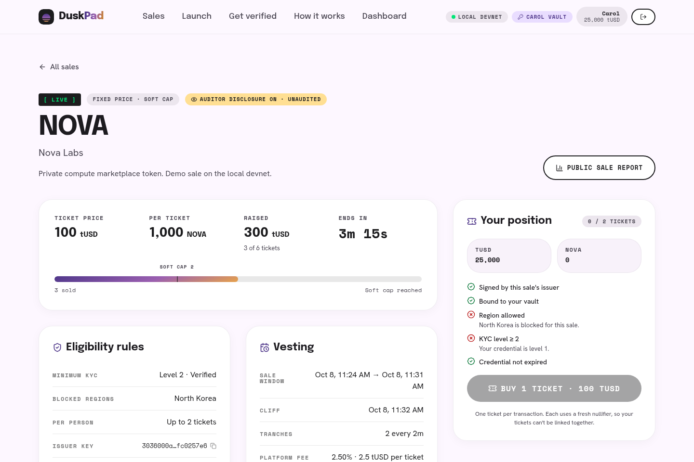 Blocked region |
| 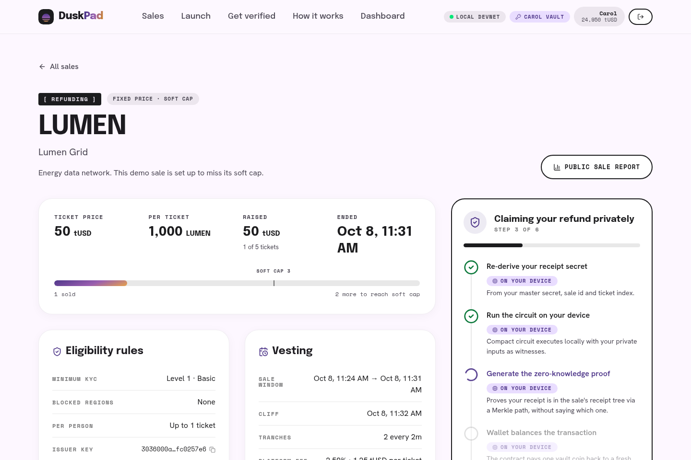 Private refund | 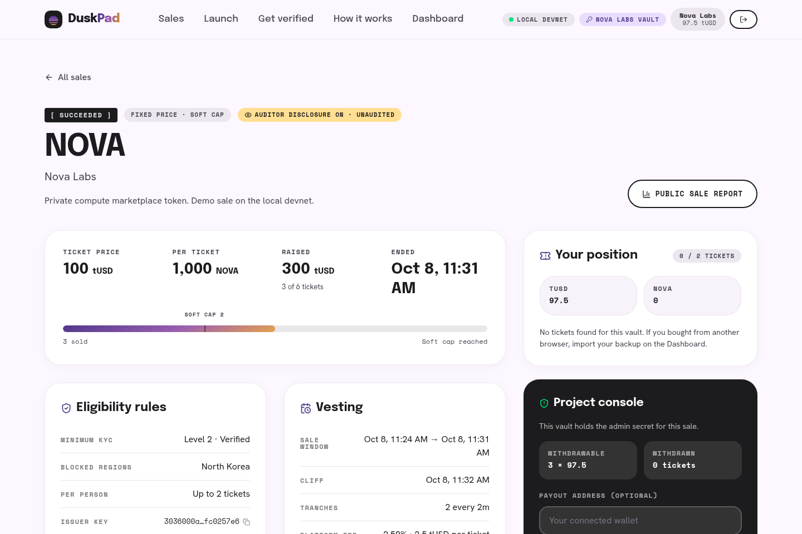 Project console |
| 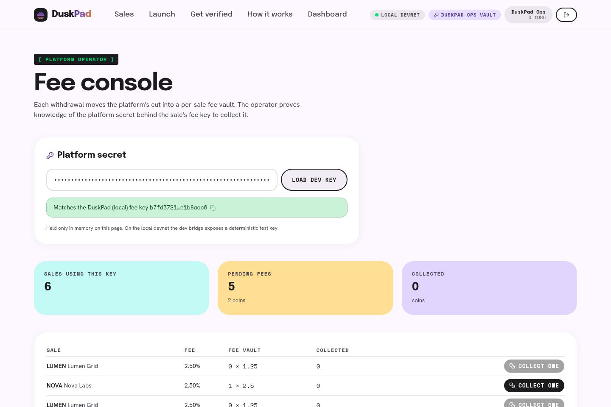 Platform fees | 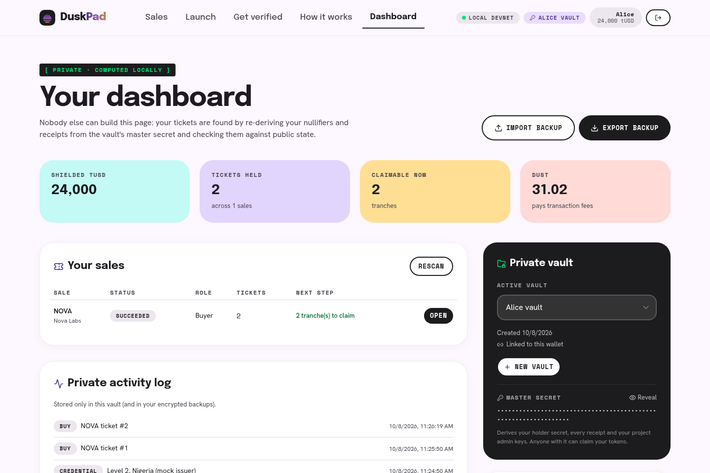 Private dashboard |
| 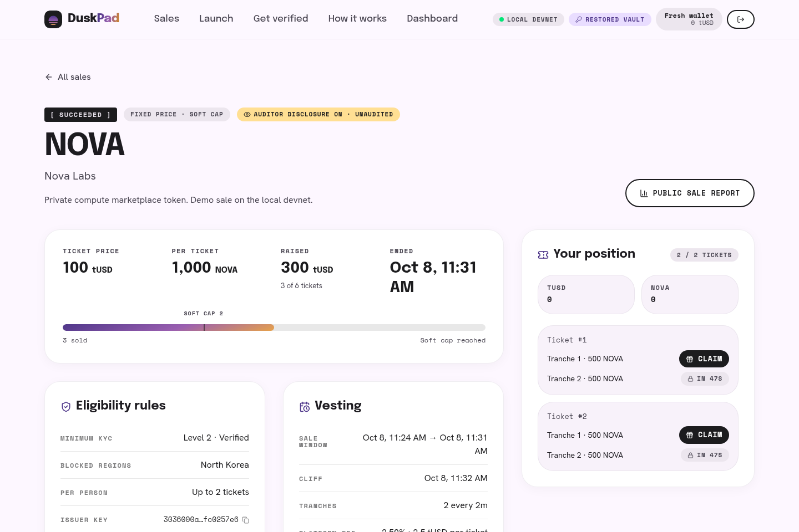 Fresh wallet after backup import | 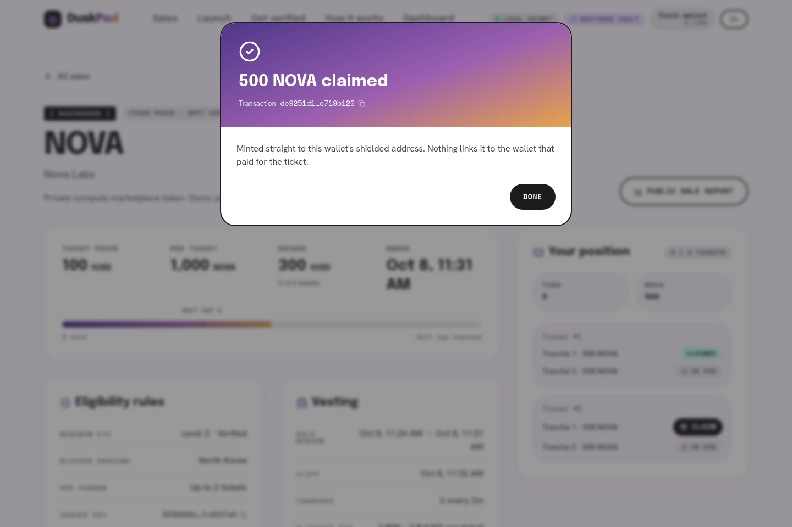 Claimed |
| 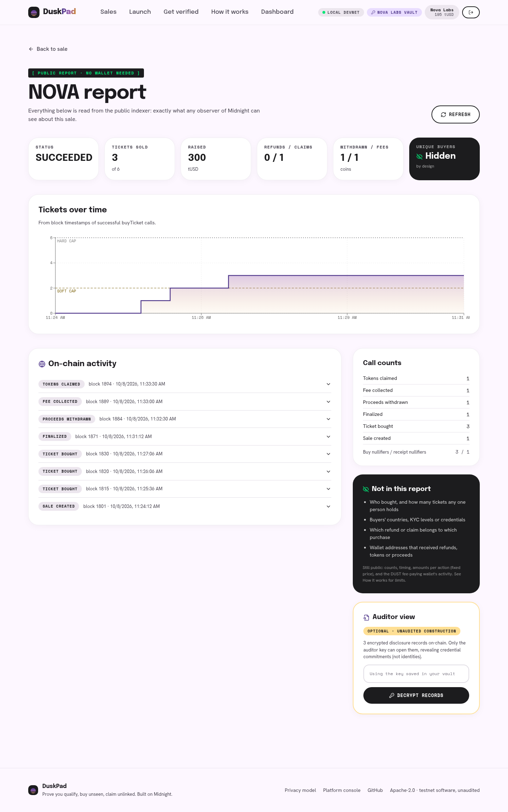 Public report | 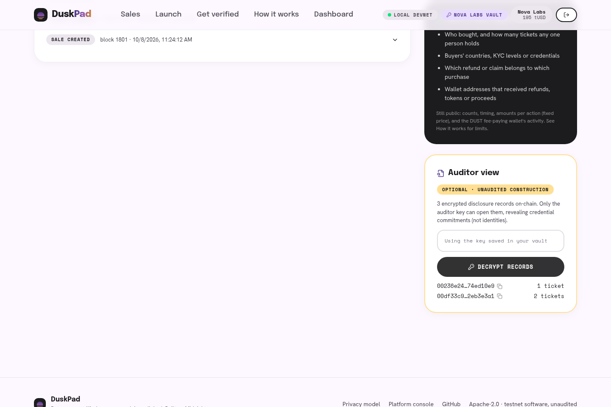 Auditor view (optional) |

CI (`ci/github-actions-ci.yml`) installs Compact 0.31.1, compiles both contracts, runs the simulator, SDK and API tests, typechecks, and builds the frontend. It lives outside `.github/workflows/` only because the token used to push this branch lacked the `workflow` scope. Moving it there (one `git mv`) activates it.

## Repository layout

```
contracts/          Compact sources, compiled output (gitignored), simulator tests
packages/sdk/       shared TypeScript SDK (browser + Node)
services/api/       mock issuer + sale registry
services/dev-wallet/ local headless wallets behind the DApp Connector interface
frontend/           React app
e2e/                e2e matrix (src/run.ts) and Playwright browser flow (ui/flow.mjs)
docker/             local Midnight stack
ci/                 GitHub Actions workflow (see Tests)
```

## Findings while building

1. **Curve operations inside an `if` broke proving.** With the auditor ElGamal computation inside `if (config.auditorEnabled)`, proof-server `/check` panicked (`Point should be part of the subgroup`) on sales with the flag off. The simulator was fine. The fix was to compute the record unconditionally and only store it inside the branch. The e2e suite covers both flag states.
2. **`kernel.self()` in a constructor is not the deployed address** (research A-0b). Token colors are derived off-chain with `rawTokenType(domain, address)`.
3. **Duplicate `onchain-runtime-v3`** breaks every call with "expected instance of StateValue". It is pinned to 3.0.0 through root `overrides`.
4. Browser bundling needs a `Buffer` polyfill (compact-runtime's Zswap helpers) and an `isomorphic-ws` named-export shim.
5. Wallets disagree on balance encodings (bigint vs decimal string), so the app normalizes them.

## Limits and future work

- One ticket per transaction. Batch buys would make amounts per transaction variable and leak more.
- One vault coin per `withdraw` / `collectFee` transaction. Batching is future work.
- A real KYC provider integration (same three signed attributes) and issuer key rotation.
- An external audit of the circuits and of the auditor-disclosure construction.
- Preprod deployment and real-extension testing (see above).

## License

Apache-2.0. See [LICENSE](LICENSE) and [NOTICE](NOTICE). Copyright 2026 Chris Gold.
